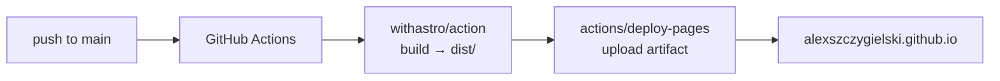

# alexszczygielski.github.io

[](https://github.com/AlexSzczygielski/AlexSzczygielski.github.io/actions/workflows/deploy.yml)


Personal portfolio and technical journal. Design inspired by the [VitePress](https://vitepress.dev) docs theme — minimal, dark-first, monospace — rebuilt from scratch as a static Astro site with no UI framework dependencies.

## Stack

| Layer | Tool |
|---|---|
| Framework | Astro 7 (static output) |
| Styling | Vanilla CSS (`src/styles/global.css`) |
| Content | Markdown via Astro Content Collections |
| Deployment | GitHub Actions → GitHub Pages |

## Structure

```
src/
├── content/
│   ├── posts/          # Journal entries (.md)
│   └── projects/       # Project write-ups (.md)
├── layouts/
│   ├── Base.astro      # Shell: nav, footer, <head>
│   └── Post.astro      # Article layout (posts + projects)
├── pages/
│   ├── index.astro
│   ├── about.astro
│   ├── posts/
│   └── projects/
├── styles/
│   └── global.css
└── content.config.ts   # Collection schemas
```

## Content

### Adding a post

Create `src/content/posts/YYYY-MM-DD-slug.md`:

```md
---
title: "Post title"
date: 2026-01-01
description: "One-line summary shown in cards and meta tags."
tags: ["tag1", "tag2"]
draft: false
---

Post body in Markdown.
```

### Adding a project

Create `src/content/projects/slug.md`:

```md
---
title: "Project name"
description: "One-line summary."
tags: ["docker", "linux"]
status: "in progress"   # in progress | complete | archived
github: "https://github.com/..."   # optional
demo: "https://..."                # optional
weight: 1                          # display order, lower = first
---

Project body in Markdown.
```

## Local development

```bash
npm install
npm run dev      # http://localhost:4321
npm run build    # output → dist/
npm run preview  # serve dist/ locally
```

Requires Node ≥ 22.12.

## Deploy flow



Workflow file: `.github/workflows/deploy.yml`. Triggered on push to `main` or manually via Actions tab.

> Work in progress lives on the `development` branch. Merge to `main` to deploy.
