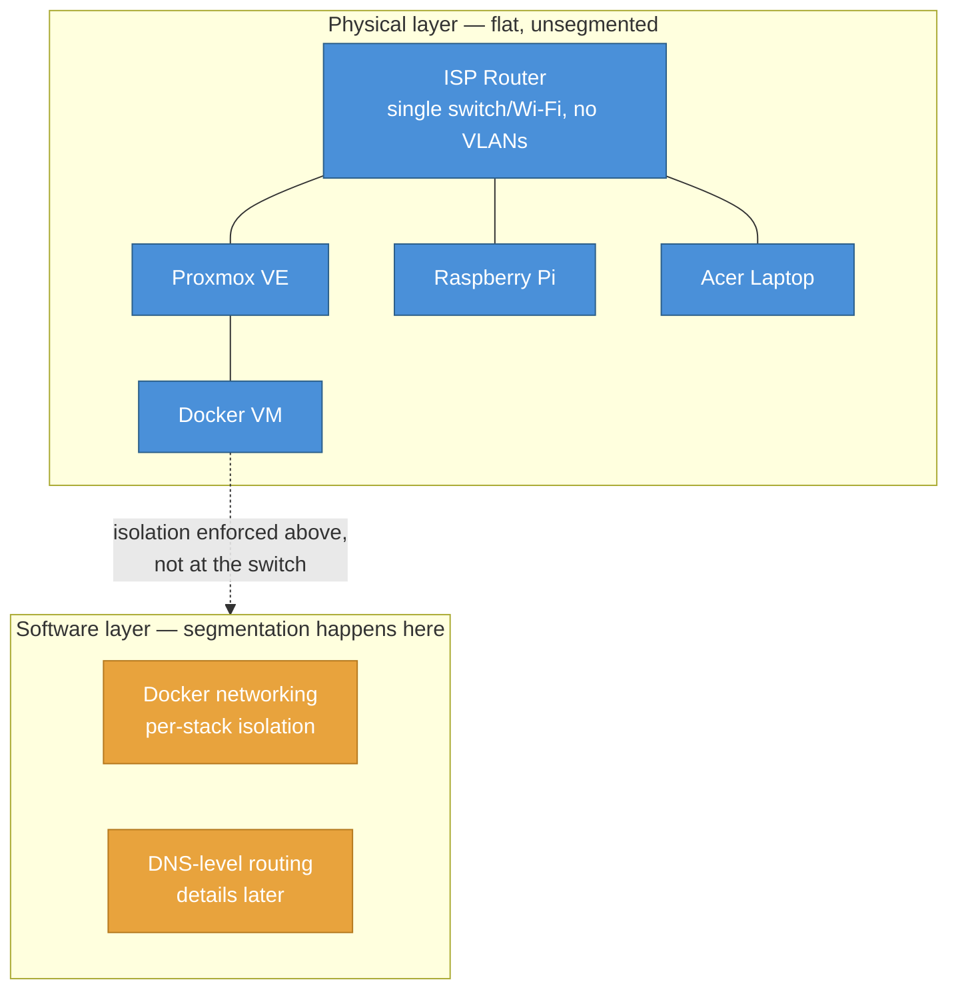

import NetworkDiagram from '../../components/NetworkDiagram.astro';
import ServiceGrid from '../../components/ServiceGrid.astro';
import TLSFlow from '../../components/TLSFlow.astro';
import ConstraintCards from '../../components/ConstraintCards.astro';

export const services = [
  { icon: '🔀', name: 'Caddy',          desc: 'Reverse proxy + automatic TLS via Cloudflare DNS-01' },
  { icon: '🛡️', name: 'Pi-hole',        desc: 'DNS resolver + ad-blocking, privacy level 3' },
  { icon: '🏠', name: 'Home Assistant', desc: 'Home automation hub' },
  { icon: '🔐', name: 'Vaultwarden',    desc: 'Self-hosted Bitwarden-compatible password manager' },
  { icon: '🐳', name: 'Portainer',      desc: 'Docker container management UI' },
  { icon: '📡', name: 'Uptime Kuma',    desc: 'Service uptime monitoring and alerting' },
  { icon: '📊', name: 'Homepage',       desc: 'Self-hosted dashboard, catch-all default site' },
  { icon: '📈', name: 'Beszel',         desc: 'Host and container resource monitoring' },
];

export const tlsFlows = [
  {
    label: 'Certificate issuance',
    steps: [
      { num: '1', name: 'Caddy',         sub: 'reverse proxy',    edge: null },
      { num: '2', name: 'Cloudflare',     sub: 'DNS-01 API',       edge: 'write TXT' },
      { num: '3', name: "Let's Encrypt",  sub: 'certificate CA',   edge: 'validate' },
      { num: '✓', name: 'Cert issued',    sub: 'publicly trusted', edge: 'issue cert', hi: true },
    ],
  },
  {
    label: 'Day-to-day request',
    steps: [
      { num: '1', name: 'Client',  sub: 'LAN / Tailscale',  edge: null },
      { num: '2', name: 'Pi-hole', sub: 'resolves hostname', edge: 'resolve' },
      { num: '3', name: 'Caddy',   sub: 'terminates TLS',   edge: 'HTTPS' },
      { num: '4', name: 'Service', sub: 'container',         edge: 'proxy' },
    ],
  },
];

export const constraints = [
  {
    icon: '🚧',
    title: 'CGNAT / DS-Lite',
    problem: 'No inbound connections from the internet — port forwarding isn\'t possible at all.',
    solution: 'Tailscale for remote access. DNS-01 challenge for cert issuance — fully outbound-only.',
  },
  {
    icon: '📡',
    title: 'No DHCP DNS push',
    problem: 'ISP router doesn\'t expose a field to hand out a custom DNS server to the whole network.',
    solution: 'Per-device DNS config pointing to Pi-hole. Devices without it just can\'t resolve internal hostnames — expected.',
  },
  {
    icon: '🏘️',
    title: 'Shared household',
    problem: 'Other people are on this network. Can\'t change network-wide settings unilaterally.',
    solution: 'Opt-in only. Pi-hole is configured on machines that need it; everyone else is unaffected.',
  },
];

**Homelab** is a friendly definition of a complete `network - computing infrastructure` system that resembles a production grade solutions by being their down scaled counterpart, hosted locally at home. Building a private infrastructure allows for a great number of activities that enhance one's knowledge, understanding and experience in broad sense IT, such as:
- self hosting,
- building (`and breaking!`) one's own network,
- managing security and access,
- systems administration,
- virtualization,
- documentation,
- testing self developed applications on local systems

Building a homelab behind ISP's CGNAT, on a shared household network, without opening ports - but still providing real trusted TLS certificates and remote access from anywhere was a challange of its own. `Here's how i tackled it and what decisions I had to make!`

## Hardware

Hardware required to run a homelab can be split into a few categories, each of which serve a specific purpose. This section explains my design decisions for each of the most important categories.

### Compute

> "Compute" - the processing resources that actually run workloads — CPU, RAM, and the hypervisor/OS layer that executes VMs and containers.

Self-hosting means freedom in one's hardware choice. We can run everything - from a single compute node to a cluster of machines, each serving a specific purpose. In my case I decided to start out with a **single node** due to the following reasons:
- lower energy consumption comparing to the cluster setup - this device is meant to be run 24/7,
- lower starting cost,
- Single node can be setup as a hypervisor and spin up multiple virtual machines, each serving a specific purpose

#### What I actually bought?

Choice for my compute node was heavily supported by researching the vast number of posts, experiences and guides from a homelabbing community. The options that most suited my needs was a computer from the `tiny/mini/micro` segment. These "length of a pencil" office desk computers are built to last and be easily serviceable. With today's hardware power they provide enough compute to easily run a hypervisor node with a homelab needs, while drawing as little energy as possible. They are also a great base for further hardware upgrades.

These machines are most often leased by commercial companies, which means that enthusiast can later acquire them used at low costs. The one that i chose was:

**HP EliteDesk 800 G1 Mini**

| | |
|---|---|
| CPU | Intel Core i5-4570T (2C/4T) |
| RAM | 8 GB DDR3 |
| Storage | 128 GB SSD |
| Hypervisor | Proxmox VE |
| Power draw | ~10-15W idle, up to ~40-50W under load |

Everything that runs on it is either virtualized or containerized (LXC) by a Proxmox hypervisor.

### Storage

> Storage - the persistent layer - where data lives when nothing's actively running it. It's the counterpart to compute: compute is the CPU/RAM doing work right now, storage is the disk holding data whether or not anything's touching it at this moment.

Currently a specific storage unit is under a development phase. It has to store persistent data and run periodic tasks, like backups. Currently I'm looking for a good deal on either a SFF computer that can hold a few disks or a RAID controller, that would do the same, but i could control it from my HP G1 mini.

To follow a 3-2-1 rule of backups, the implementation of a remote storage - either off site on another self hosted platform or in cloud is also in plans.

### Network

> Network - the layer that lets compute and storage talk to each other and to the outside world - the wiring, addressing, and routing that turns a pile of separate machines into one system.

For now the network runs entirely on the ISP-issued router. A managed switch (for VLANs / traffic segmentation) in tandem with router capable of running pfsense or opensense OS is the next step. As ISP's router does not allow bridging, I will be looking into the `double NAT` solution. Right now everything that needs isolation gets it in software instead, one layer up.

Everything sits on one flat physical layer today - segmentation, where it exists, is enforced one layer up:

### Other devices
A Raspberry Pi 4B sits on the network to act as a very primitive KVM, which can remotely turn on other devices on the network. It is a part of my experiment to write a custom wake on lan script that uses VPS relay and polling technique to wake other machines, without exposing any shell or without having any remote access to the network.
> [Custom Remote Wake On Lan Repo](https://github.com/AlexSzczygielski/vps-wake-on-lan-no-ssh)

Acer on the other hand is my only machine that runs Windows, if I ever need to use this OS.

## Network topology

<NetworkDiagram />

Remote access via **Tailscale** — point-to-point mesh, no port forwarding, works transparently through CGNAT.

## Constraints that shaped the design

<ConstraintCards constraints={constraints} />

## Real TLS with no open ports

Every service gets a **publicly-trusted Let's Encrypt certificate** with zero inbound connections needed. The trick is the **DNS-01 challenge** — Caddy proves domain ownership by writing a TXT record via Cloudflare's API rather than serving a file over HTTP. No open port, no public-facing server.

Domain `casamia-net.top` is registered at Porkbun, nameservers delegated to Cloudflare. Each service gets two URLs — `<service>.casamia-net.top` for LAN, `<service>.ts.casamia-net.top` for Tailscale — with Pi-hole wildcards resolving each to the right IP. Adding a new service to Caddy requires zero Pi-hole changes.

<TLSFlow flows={tlsFlows} />

## Services

<ServiceGrid services={services} />

All services deploy from one root `docker compose up -d` via Compose's `include:` directive. Persistent data lives under `/opt/docker-data/<service>` — one path to back up everything.

## Repos

- [casa-mia-network](https://github.com/AlexSzczygielski/casa-mia-network) — topology, IP allocation, node config
- [casa-mia-net-infrastructure](https://github.com/AlexSzczygielski/casa-mia-net-infrastructure) — Docker Compose services, Caddy, Pi-hole config, [online docs](https://alexszczygielski.github.io/casa-mia-net-infrastructure/)